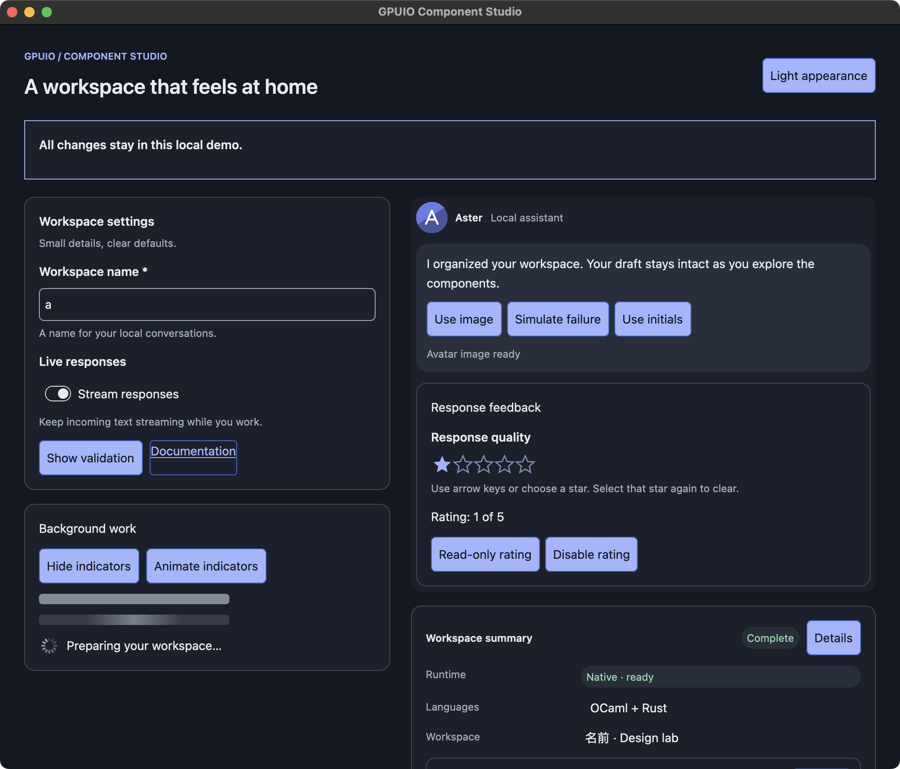
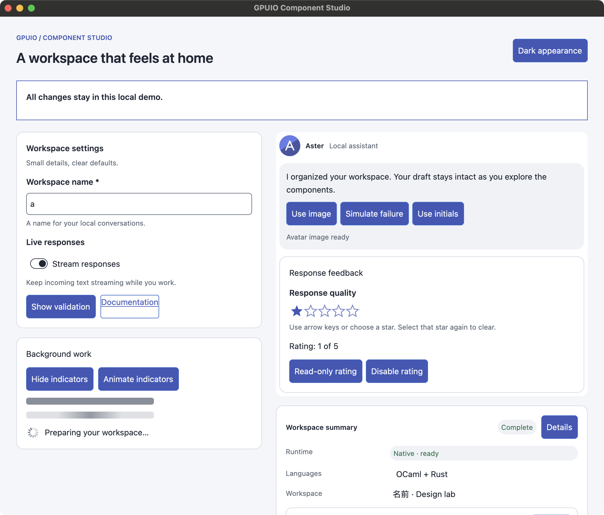

# Presentation component evidence (OCH-33)

Current state: the complete OCH-33 family is implemented and local component plus
cross-family content acceptance passes. Presentation capability `17179869184` is
advertised and its final integrated checks pass; hosted gates and merge remain
pending. The sections below preserve incremental checkpoint evidence and its
original scope. Older lists of remaining components are historical.

## Semantic, form and stateless presentation foundation

Local macOS arm64, 2026-09-25; stock project OCaml 5.3/Bonsai v0.17 pins and
isolated toolchain. This checkpoint is **partial OCH-33 implementation**. Avatar
asset fallback, native loading indicators, rating and complete theme/scale/content/
lifetime acceptance remain. No OCH-33 capability or hosted/Linux result is claimed.

`Accessibility` validates bounded UTF-8 labels/help/errors, heading levels and
live-region priorities. `View.with_accessibility` and its Bonsai specialization
preserve identity and reject ambiguous/unsupported native roots. Appended wire
operation 39 sets or clears metadata independently of styles and editor config;
previous tags are unchanged. Native admission is atomic and charges retained
metadata storage to the existing tree budget. Text is bounded to 4096 bytes per
string; the standalone decoder bounds configuration bytes to 16384 and rejects
invalid strings/combinations, truncated/trailing data and oversized declarations.

Three independent OCaml/Rust fixtures cover field data, full update/reset messages
and Status/Alert/Heading/Link roles. Tests prove metadata-only changes do not create,
remove or reset controls, unchanged semantics emit no transaction, and invalid
native updates roll back preceding text changes and revision/accounting. Removal
reclaims retained storage. AccessKit metadata preserves native role/actions,
read-only state, and adds required/invalid properties. Explicit synthetic label,
description and error relationships use the existing GPUI builder; no fork patch
or new callback runtime was needed.

The native `native_presentation` test passed actual AppKit field label/help/error/
required output, updates and reset during marked-text composition, exact editor
snapshot retention, AXLink and keyboard activation, and editor/tree disposal.
AccessKit's invalid/relationship data is not exposed as a corresponding macOS AX
attribute in every case; do not infer a full assistive-technology audit from the
programmatic label/help/required checks. The public example adds real keyboard
delivery through macOS's event API. No physical monitor-scale transition or Linux
GUI acceptance is claimed here.

`Form.field` adds application-owned label/help/error layout around supported native
controls. Its internal keys preserve the control when optional help/error or layout
changes. Validation and editor ownership remain with the caller; the static label
does not install an extra focus target or a click-to-focus action.

`Presentation` implements label, badge/tag/marker, Link, separator, group/settings,
description list, empty state, alert/banner, shortcut/status bar and attachment/
message/bubble/tool-result compositions. Concrete light/dark appearances do not
require new theme tokens; applications can provide custom colors or tokens.
Named slots preserve child identities. These helpers create only ordinary text/
container views and explicit caller actions; they own no independent controllers,
timers, assets or documents. Expect tests cover empty/localized/10,000-character
content admission in both themes, no-op updates, optional-slot body identity,
latest action dispatch/disabled fencing and explicit live/description semantics.
This is admission/identity coverage, not proof that every long-text layout is good.

The [public example](../../examples/presentation/README.md) composes a settings
form, details, chat message, tool result and attachment through ordinary public
Core/Bonsai/Eio APIs. Its self-test waits for acknowledged frames across dark/light,
error insertion/removal and verifies exact native editor snapshots and shutdown.
`scripts/test_presentation.py` separately exercises real keyboard input, native
field help/error, retained text after theme changes, AXLink, card actions and close.
All owned children are reaped on success or failure.

Initial screenshot inspection caught compressed card actions and incorrect light
control defaults. Stable action wrappers now retain intrinsic width; the example
and link set their intended colors. The external AX test guards action dimensions.
Corrected dark/light screenshots were inspected at 1040×860 logical window size
on the development display. They are checkpoint images, not the final OCH-46 demo.





Passing local commands, with `GPUIO_JOBS=2`:

```sh
./scripts/gpuio exec dune build -j 2 @all @runtest @fmt
./scripts/gpuio exec cargo test --workspace --locked -j 2
./scripts/gpuio exec cargo clippy --locked --workspace --all-targets --features gpuio-native/native-image-tests,gpuio-native/native-canvas-tests -j 2 -- -D warnings
./scripts/gpuio exec dune exec -j 2 examples/presentation/main.exe -- --self-test
python3 scripts/test_presentation.py --images scratch/presentation-images
./scripts/gpuio exec cargo test --locked -p gpuio-native --features native-tests --test native_presentation --test native_controls --test native_editor --no-run -j 2
```

The three built native executables were then run directly with a 60-second timeout
per target and all passed. This also revalidates existing controls, menus/palette,
progress/toasts/pointer behavior and the editor's grapheme, clipboard, focus,
revision, resize and AppKit text-client paths through the shared semantic wrapper.
Native marker output includes `GPUIO_PRESENTATION_SEMANTICS_OK`,
`GPUIO_PRESENTATION_AX_OK`, `GPUIO_CONTROLS_NATIVE_OK`,
`GPUIO_CONTROLS_MACOS_AX_OK`, `GPUIO_EDITOR_NATIVE_OK` and
`GPUIO_EDITOR_MACOS_TEXT_CLIENT_OK`.

CI definitions include native/public/AX checks for this foundation, but the milestone's
consolidated hosted run and merge are still pending. Continue with avatar, loading
and rating; extend the example and complete OCH-33's acceptance before marking it
Done. OCH-46 remains the final integrated chat showcase after all component tickets.

## Native loading indicators

The next checkpoint adds `Loading.Kind`/`Config` and `View.loading` (also in
`Gpuio_bonsai.View`) with native Skeleton, Shimmer and Spinner presentations.
Wire kind 34 and operation 40 are appended; no existing tags or capability mask
change. Labels are nonblank UTF-8 without NUL, at most 4096 bytes. The native period
is 100..60000ms, defaults to 1200ms and rounds up at the public API boundary.
Explicit `animated=false` and application reduced motion produce static output.

Native paint is bounded to one skeleton quad, three shimmer quads or twelve spinner
strokes. Size/color come from ordinary styles. The existing radius-capture wrapper
transfers computed placeholder corners to paint, including the clipped shimmer
highlight. The leaf owns no editor/controller, worker task, event callback or
OCaml clock. GPUI advances its animation while visible; configuration changes
retain the native node and do not invent a completed fraction.

The independent `loading-request.hex` fixture contains all three kinds and minimum,
default and maximum periods. OCaml/Rust checks agree on its exact bytes. Rust
rejects every truncated prefix, trailing bytes, invalid UTF-8, oversized/blank/NUL
labels and invalid periods. Expect tests cover validation/rounding, no-op updates,
no callback binding and same-leaf shape/static changes. Native admission rejects
missing configuration, handlers and child text atomically, preserving previous
state/accounting; disposal reclaims storage.

Actual macOS native checks pass for all three cycles advancing without tree commits,
size/color/radius overrides, indeterminate AX roles, reduced/static whole-window
idle, parent-hidden idle, resume and weak-state/tree disposal. A real minimize/
restore check also passes: the minimized window stops rendering and animation
resumes after restoration. Markers are `GPUIO_LOADING_NATIVE_OK` and
`GPUIO_LOADING_MINIMIZED_OK`.

The first external AX check found that hidden indicators stopped painting but
remained exposed through accessibility. The shared semantic wrapper now writes
AccessKit's hidden state from the existing native visibility policy. A hidden
structural element without a role gets a Group node so that its descendants can
be hidden too. This is an internal semantic fix, not a new protocol field. Unit
coverage checks that representation, and both native and external tests now prove
the indicators disappear and return in the actual macOS AX tree. External tests
also assert that indeterminate loading has no numeric AX value.

Component Studio now exposes all three loading forms plus Hide/Show and Static/
Animate controls. Its public self-test retains the editor through these updates.
Both themes were captured and inspected; the screenshots above show the expanded
example. Rounded shapes, centered static shimmer and radial spinner are visible.
This does not claim a physical monitor-scale test or a full VoiceOver audit.

Passing checks use the isolated jobs=2 toolchain: full Dune `@all @runtest @fmt`,
Rust workspace tests, default and native-image/native-canvas all-target Clippy,
public `--self-test` and `scripts/test_presentation.py`. Native presentation is
rebuilt with the new loading checks. Native presentation, controls, editor and
container-query executables were built with `native-image-tests` and run directly
with a 90-second timeout each; all pass. The query regression includes retained
editor/IME isolation, native hidden accessibility, scaled layout and its existing
256-query workload. All owned native and public test windows/processes were
closed/reaped; no hosted or Linux GUI result is claimed.

Avatar fallback, rating and the complete OCH-33 family acceptance remain pending.
The existing presentation CI step automatically includes the extended native/public
tests; consolidated hosted gates and milestone-05 merge still follow local scope.

## Native avatar and fallback

The avatar checkpoint adds `Avatar.Fallback`/`Config`, `View.avatar` and its Bonsai
specialization. Wire kind 35 and operation 41 are appended without changing old
tags or the capability mask. Explicit fallback text is nonblank UTF-8, bounded to
128 bytes and rejects ASCII controls. Descriptions reuse `Image.Description`.
Absent sources own no image reader and generate no artificial failure. Supplied
sources use the existing scoped asset/image leases, budgets and observations.

Independent OCaml/Rust fixtures cover absent, unavailable and registered sources.
Core tests cover bounds, source ownership, no-op/config-only updates, stable node
identity, latest callback selection, source-replacement handler generations,
unbinding and stale callbacks. The strict Rust decoder checks truncated/trailing
bytes, UTF-8 and declared string bounds. Native transaction tests prove malformed
updates roll back configuration, derived image metadata, revision and accounting;
source removal must unbind its observer in the same transaction. Removal returns
retained-tree accounting to zero.

Actual macOS `native_image_views` checks paint centered fallback glyphs and a
ready raster's interior with circular corner clipping. They verify default 32x32
logical dimensions and caller styling, one AXImage label in fallback/image modes,
no separate semantic initials child, and decorative label removal. A retired
registered source remains usable by its mounted lease; replacement drops the
old binding. Invalid encoded data paints the fallback and reports InvalidData.
A valid SVG, invalid measured size, and return to the exact previous valid size
exercise ResourceLimit failure/recovery, actual pixels and deferred status events.
Synthetic GPUI density changes at 1, 1.5 and 2 preserve logical size and tree
revision while requesting the appropriate native raster. Returning to no source
releases the binding, rejects obsolete observations and becomes render-idle.
Disposal returns retained-tree accounting to zero. This does not claim zero
process RSS, physical monitor transitions or a full assistive-technology audit.

That native regression found two shared SVG issues: a layout-size error survived
returning to the last successful request, and paint-discovered failure could
leave the view's observer reporting Ready. Layout errors are now independent of
real decode/upload failures. Paint defers weak-owner invalidation until after the
frame; normal source/handler-checked delivery then reports failure and recovery.
The existing image, SVG density/foreground and button-icon scenarios also pass.

Component Studio's embedded SVG and deliberately invalid image bytes use public
Eio registration. Use image / Simulate failure / Use initials exercise native
fallback selection with a stable accessible label. Its public self-test waits for
Ready and Failed Invalid_data while checking exact editor retention. External
macOS AX/keyboard validation exercises these controls, existing field/error and
loading behavior, themes and native close. The dark/light screenshots above were
updated and visually inspected. All launched test windows/processes are reaped.

The avatar native marker is `GPUIO_AVATAR_NATIVE_OK`; it runs within the existing
`native_image_views` CI target. Required consolidated hosted macOS/Linux gates and
merge remain pending. Rating and the remaining OCH-33 family acceptance are still
outstanding; this checkpoint does not complete the ticket or milestone.

Final avatar checkpoint validation (local macOS arm64, isolated `GPUIO_JOBS=2`):

```sh
./scripts/gpuio exec dune build -j 2 @all @runtest @fmt
./scripts/gpuio exec cargo test --workspace --locked -j 2
./scripts/gpuio exec cargo clippy --locked --workspace --all-targets -j 2 -- -D warnings
./scripts/gpuio exec cargo clippy --locked --workspace --all-targets --features gpuio-native/native-image-tests,gpuio-native/native-canvas-tests -j 2 -- -D warnings
./scripts/gpuio exec cargo test --locked -j 2 -p gpuio-native --features native-image-tests --test native_image_views --no-run
```

All pass. The freshly built `native_image_views` executable then passes under a
90-second timeout, including deferred mailbox failure→Ready ordering. The freshly
built public Component Studio `--self-test` passes under a 45-second timeout.
`scripts/test_presentation.py --images scratch/agents/root-20260924-m5/avatar-images`
passed the actual macOS interaction/screenshot walkthrough. No hosted result is
claimed for these local commands.

## Controlled rating implementation

The rating implementation adds `Rating.Request` and validated `Rating.Config`,
`View.rating ~config ~on_request ()` and the Bonsai alias. Value is zero through
maximum, maximum is 1..32 (default five), and star size is 8..128 logical pixels
(default 24). Zero means unrated. Labels use the existing bounded UTF-8 policy.
New kind 36, operation 42 and event 43 are appended; no earlier tag changes.

Requests are Set, Toggle, Increase and Decrease. The public pure
`Rating.Config.apply_request` reduces them against the application's latest model,
saturates steps, toggles an already selected star to zero and ignores requests
invalidated by a changed range or read-only/disabled policy. Native hover owns no
committed value and emits no application event. Every discrete request uses the
existing bounded mailbox with current node/handler/revision/policy checks. No
native acknowledgement queue, optimistic model or per-frame OCaml callback is
introduced. The native owner retains only a bounded hover value and focus state.

Independent OCaml/Rust fixtures agree on configuration and all four event requests.
Core expect tests pass malformed configuration, ordered reducer bursts, current
range rejection, no-op/latest-callback updates and disabled/read-only/stale-handler
fences. Rust codec tests pass invalid labels, bounds, floats, truncated/trailing
bytes and request validation. Native transaction tests pass missing-handler and
invalid-update rejection, exact revision/config/accounting rollback, current
policy and generation checks, and complete retained-tree disposal.

The initial actual macOS native test passes native-only hover, GPU filled/outline
star centers, four consecutive relative key requests without an intervening tree
transaction, Home/End/Delete/Backspace and modified-key behavior, and single-stop
Tab traversal. AppKit reports AXSlider with committed value and 0..maximum range;
Increment, Decrement and SetValue deliver requests. Fractional SetValue is rejected.
Read-only remains readable and focusable with no mutation; disabled removes focus.
Ancestor hiding clears preview and removes AX exposure. Static idle and weak-state/
tree disposal pass. The expanded pointer-policy/modal/maximum/density checks are
recorded in the final checkpoint below once executed; they are not implied by
this initial run.

Component Studio applies requests through a Bonsai state machine and places a
Form.field-labelled rating in the assistant message's feedback section. Its
public self-test passes burst saturation, toggle-to-zero and subsequent read-only
rejection alongside unchanged native editor snapshots and avatar transitions.

Expanded actual macOS checks now also pass pointer-disabled ratings retaining
keyboard behavior, exclusion by a real modal dialog, and 32 stars at the minimum
8px size under synthetic densities 1, 1.5, 2 and restoration. Raster checks require
opaque foreground in the nearest 3×3 region around a star's logical center:
fractional-density multisample boundaries can partially cover the single rounded
center pixel. Outline centers remain unfilled. This is not a physical monitor
transition claim. The native marker is `GPUIO_RATING_NATIVE_OK` within the existing
`native_presentation` executable (GPU checks require `native-image-tests`).

The public macOS AX/keyboard walkthrough passes real Right-key bursts to the upper
bound, Home to zero, AXIncrement, read-only rejection, disable/enable and theme
switching. Both appearances were visually inspected; inactive star outlines were
strengthened afterward. The response feedback appears inside the assistant card.
All owned windows/processes were closed and reaped. The current ticket remains
In Progress until final cross-family content/layout acceptance is complete.

Final rating checkpoint (local macOS arm64): full Dune `@all @runtest @fmt`,
Rust workspace tests, and all-target Clippy with default, `native-tests`, and
combined `native-image-tests,native-canvas-tests` features pass. The freshly built
GPU-enabled `native_presentation` passes both `GPUIO_RATING_GPU_OK` and
`GPUIO_RATING_NATIVE_OK`, alongside existing loading and form/IME/AX checks.
Component Studio `--self-test` and `scripts/test_presentation.py` pass. Final
light/dark screenshots were recaptured, visually inspected and copied into
`docs/images/presentation-{dark,light}.png`. CI now runs presentation GPU checks;
these results are local evidence, not hosted validation.

## Cross-family native content acceptance

The public Component Studio `--content-check` fixture cycles 19 presentation/form
families through long, empty and localized content. `scripts/test_presentation_content.py`
passes 228 actual native combinations: 19 families × 3 content variants × 2
appearances × 2 window widths (440/800 logical pixels). It checks finite,
nonnegative native text/control bounds within the window and noncollapsed action
bounds, invokes 120 visible card actions, verifies their effects, then closes and
reaps the process. Localized fixtures include Japanese, French, German and a
joined emoji; this does not assert complete bidi layout or localization services.

The initial run found intrinsic-width overflow in long tag text. Presentation
rows now allow label text to shrink and wrap, and status-leading content flexes
while action slots keep their required space. The full walkthrough passes with
these changes. This supplements prior semantic/controller-lifetime, loading
idle/reduced-motion, avatar failure/density and rating input/disposal evidence.

Reproduce after building the public example:

```sh
python3 scripts/test_presentation_content.py --images scratch/presentation-content
```

Final local checks with the capability enabled pass: Dune `@all @runtest @fmt`,
Rust workspace tests, combined GPU-feature all-target Clippy, freshly built
`native_presentation`, public Component Studio `--self-test`, and both external
AX walkthroughs. Independent OCaml/Rust Hello fixtures agree on
`0001fcffffffff07000000` (aggregate `34359738367`). Native tests retain the prior
form/IME, loading/minimize, and rating GPU/input markers. Normal Studio screenshots
were refreshed and inspected after the wrapping changes; a diagnostic
[narrow localized message capture](../images/presentation-content-message.png)
shows the acceptance fixture. This fixture is deliberately repetitive test
content; the polished integrated chat showcase remains OCH-46.

Local OCH-33 implementation and acceptance are complete. Consolidated hosted
macOS/Linux build/unit gates and merge are still required before ticket closure.
Linux GUI, physical display transitions and a complete VoiceOver user journey
have not been claimed by these tests.
