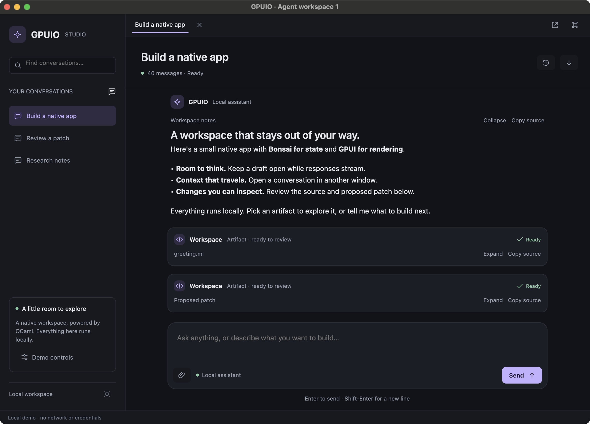

# Agent workspace

A runnable OCaml/Bonsai/Core/Eio application using the public GPUIO APIs. It has a
conversation sidebar and search, retained tabs, a resizable sidebar, a paged
transcript, native composers, Markdown/code/diff tool cards, text attachments,
commands, light/dark appearance and independent windows sharing conversations.
The deterministic local backend needs no credentials or network connection.



[Light appearance](../../docs/images/studio-light.png) uses the same semantic palette and layout.

```sh
GPUIO_JOBS=2 ./scripts/gpuio exec dune build examples/agent_chat/main.exe -j 2
_build/default/examples/agent_chat/main.exe
```

Enter sends; Shift-Enter inserts a newline. Send captures the current native
editor contents. Editing while acceptance is pending preserves the newer draft.
Open Demo controls to choose Normal stream, Slow stream or Simulate error before sending; Cancel keeps
partial output and Retry response resets that response. Load older prepends saved
history without moving your reading anchor. Latest returns to the growing tail.
Closing/reopening a conversation tab preserves its draft and reading position.
New window opens the selected conversation with a separate draft and viewport.
Closing a window with drafts asks for a decision; other windows remain usable.

Primary-Shift-P opens the command palette, Primary-N opens another window,
Primary-Shift-[ / ] changes tabs, and Primary-W closes a tab. Primary means
Command on macOS and Control on Linux. The Workspace menu exposes the same
window-scoped commands. Split dividers support pointer resizing and native
keyboard/accessibility actions.

The paperclip (Attach text) opens a native picker, then reads the selected path through Eio in
the originating window's scope. UTF-8 text files up to 64 KiB become transcript
artifacts. `--directory /absolute/path` supplies an optional starting-folder hint. Binary/NUL-containing input and larger files report an error. Markdown
links report a navigation intent in the status area; the demo does not launch a
browser or execute tool output.

The example deliberately bounds retained state: three seeded conversations,
four live windows, three retained panels per window, 64 responses and eight text
attachments per conversation. Each conversation starts with 40 of 200 saved
messages. Conversation history is synthetic and session state is in memory;
closing the application discards it. A real application supplies persistence,
provider integration, credentials and orchestration through its own Eio services.
This example is not a provider client or a storage layer.

## Implementation map

- `model/fake_backend`: pure chunk/delay/failure configuration and fixtures.
- `runtime/icons` and `runtime/palette`: original SVG assets and semantic light/dark colors.
- `runtime/conversation`: shared conversation scopes, paging, response documents,
  bounded attachments, cancellation and retry.
- `runtime/workspace`: one window's tabs, editors, list views, commands and close
  decision; composed entirely through public view/controller APIs.
- `main.ml`: Eio capabilities, window creation and integration acceptance runner.

The [ownership design](../../docs/design/agent-workspace.md) explains why hiding a
row, closing a tab and closing a window have different effects on streaming.

## Validation

```sh
_build/default/examples/agent_chat/main.exe --self-test
python3 scripts/test_agent_chat.py
```

The first opens real native windows and drives public controllers: exact submit,
concurrent streams, protected drafts, cancellation/retry/errors, history anchoring,
retained tabs, independent windows, attachments and pending-send cancellation.
It does not simulate external OS keystrokes. The second is a macOS-only external
accessibility/keyboard test targeting only its child application's PID. It needs
Accessibility permission and reaps its child on success or failure. It exercises
actual native UI activation, Return, the picker, tab/window/theme/palette controls
and OS close decisions. `--native-test` only lengthens fake send acceptance to
make the newer-draft race observable and prints a marker after `App.run` returns.
Linux GUI execution remains informational under OCH-17; Linux build/unit checks
remain required. See [milestone evidence](../../docs/evidence/agent-workspace-m4.md).
