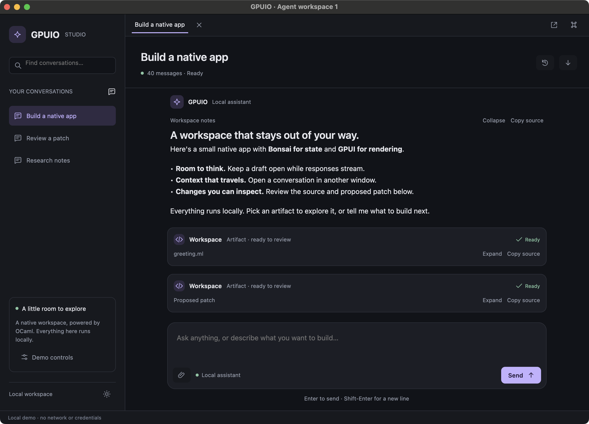

# Agent workspace

A runnable OCaml/Bonsai/Core/Eio application using the public GPUIO APIs. It has a
conversation sidebar and search, retained tabs, a resizable sidebar, a paged
transcript, native composers, Markdown/code/diff tool cards, text attachments,
commands, light/dark appearance and independent windows sharing conversations.
The deterministic local backend needs no credentials or network connection.



[Light appearance](../../docs/images/studio-light.png) uses the same semantic palette and layout.

```sh
GPUIO_JOBS=2 ./scripts/gpuio exec dune build examples/agent_chat/main.exe -j 2
_build/default/examples/agent_chat/main.exe
```

Enter sends; Shift-Enter inserts a newline. Send captures the current native
editor contents. Editing while acceptance is pending preserves the newer draft.
Open Demo controls to choose Normal stream, Slow stream or Simulate error before sending; Cancel keeps
partial output and Retry response resets that response. Load older prepends saved
history without moving your reading anchor. Latest returns to the growing tail.
Closing/reopening a conversation tab preserves its draft and reading position.
New window opens the selected conversation with a separate draft and viewport.
Closing a window with drafts asks for a decision; other windows remain usable.

Primary-Shift-P opens the command palette, Primary-N opens another window,
Primary-Shift-[ / ] changes tabs, and Primary-W closes a tab. Primary means
Command on macOS and Control on Linux. The Workspace menu exposes the same
window-scoped commands. Split dividers support pointer resizing and native
keyboard/accessibility actions.

The paperclip (Attach text) opens a native picker, then reads the selected path through Eio in
the originating window's scope. UTF-8 text files up to 64 KiB become transcript
artifacts. `--directory /absolute/path` supplies an optional starting-folder hint. Binary/NUL-containing input and larger files report an error. Markdown
links report a navigation intent in the status area; the demo does not launch a
browser or execute tool output.

The example deliberately bounds retained state: three seeded conversations,
four live windows, three retained panels per window, 64 responses and eight text
attachments per conversation. Each conversation starts with 40 of 200 saved
messages. Conversation history is synthetic and session state is in memory;
closing the application discards it. A real application supplies persistence,
provider integration, credentials and orchestration through its own Eio services.
This example is not a provider client or a storage layer.

## Read the code

Begin with the [small counter](../getting_started/README.md) if Bonsai is new to
you. For this larger app, read the [CLI and package metadata](main.md), then
[application assembly](application.md), then the
[deterministic response model](model/fake_backend.md). The assembly guide explains
which resources belong to the application and which belong to each window; the
model guide follows a send through acceptance, byte chunks, completion and retry.
The model's companion also explains its supporting expect test. Continue with
[transcript message composition](runtime/chat_message.md) and
[native workspace motion](runtime/chat_motion.md) to see small stateless view
helpers and their caller-owned Bonsai state. The
[shared conversation controller](runtime/conversation.md) then explains the full
acceptance/producer/document lifecycle, history loading and attachments. For the
larger fixtures, read [bounded CPU jobs](runtime/fixture_job.md), then
[native query loading](runtime/query_loading.md) and
[guarded finding actions](runtime/result_actions.md). These helpers separate
producer scheduling, pending-state presentation and current-row inspection. Continue
with the [source explorer](runtime/sources.md) and its
[pure tree fixtures/moves](runtime/source_data.md), then the
[results controller](runtime/results.md) and
[complete query/data model](runtime/result_data.md). Their guides trace lazy
loading, current-generation delivery, virtualized rows/cells and accepted moves. Settings helpers have separate guides for
[accepted generation parameters](runtime/generation_settings.md),
[fixed civil-date fixtures](runtime/schedule_data.md),
[review dates and follow-up selection](runtime/schedule_settings.md), and
[confirmed annotation color](runtime/annotation_settings.md). They distinguish
native drafts/previews from accepted window values. The
[native review counter](runtime/review.md) and
[window-local feedback](runtime/review_feedback.md) explain extension events,
retained note editing and controlled disclosure. Small supporting guides cover
[inclusive score bounds](runtime/score_range.md) and
[native responsive alternatives](runtime/responsive.md). Navigation/presentation support is explained in
[artifact destinations](runtime/artifact_sidebar.md), the
[four-page tour](runtime/artifact_tour.md), and
[local portrait decoding/fallback](runtime/contributor_portrait.md). The shared
[SVG icon registrations](runtime/icons.md) and
[semantic palette](runtime/palette.md) separate resources from pure styling. The main composition guides are
[workspace panels, commands and close handling](runtime/workspace.md),
[artifact navigation/lifetimes](runtime/inspector.md), and
[settings epochs/native drafts](runtime/settings.md). For the canvas, read the
[pure stage/scene model](runtime/run_diagram.md), then its
[scoped diagram controller](runtime/diagram.md).

These are code walkthroughs, not new platform acceptance evidence. The runtime
source map below identifies the remaining component boundaries; per-component
review status is explicit in the [coverage inventory](../coverage.md).

## Implementation map

- [Model/fake backend](model/fake_backend.md): pure chunk/delay/failure configuration and fixtures.
- [Icons](runtime/icons.md) and [palette](runtime/palette.md): original SVG assets and semantic light/dark colors.
- [Shared conversation](runtime/conversation.md): conversation scopes, paging, response documents,
  bounded attachments, cancellation and retry.
- [Workspace](runtime/workspace.md): one window's tabs, editors, list views, commands and close
  decision; composed entirely through public view/controller APIs.
- [CLI walkthrough](main.md), with [`main.ml`](main.ml): command-line options and package metadata only.
- [Application walkthrough](application.md), with [`application.ml`](application.ml)
  and [`application.mli`](application.mli): Eio capabilities, conversation ownership,
  window creation and resource cleanup. Start here to see how the app is assembled.
- [Self-test walkthrough](self_test.md), with [`self_test.ml`](self_test.ml) and
  [`self_test.mli`](self_test.mli): optional programmatic integration driver.
- [Workload metrics walkthrough](workload_metrics.md), with
  [`workload_metrics.ml`](workload_metrics.ml) and [`workload_metrics.mli`](workload_metrics.mli):
  opt-in sampled diagnostics, kept out of ordinary startup.

For the UI, follow `runtime/workspace.ml`'s `component` function: `Bonsai` owns
reactive observations, `Effect` describes deferred actions, and `View` creates
GPUIO elements. The workspace delegates conversation content, settings and
inspector features to their own modules. For a smaller introduction to the same
boundaries, read the [counter](../getting_started/README.md) and the gallery's
[separate component and shell](../gallery/README.md#reading-the-code).

The [ownership design](../../docs/design/agent-workspace.md) explains why hiding a
row, closing a tab and closing a window have different effects on streaming.

## Validation

```sh
_build/default/examples/agent_chat/main.exe --self-test
python3 scripts/test_agent_chat.py
```

The first opens real native windows and drives public controllers: exact submit,
concurrent streams, protected drafts, cancellation/retry/errors, history anchoring,
retained tabs, independent windows, attachments and pending-send cancellation.
It does not simulate external OS keystrokes. The second is a macOS-only external
accessibility/keyboard test targeting only its child application's PID. It needs
Accessibility permission and reaps its child on success or failure. It exercises
actual native UI activation, Return, the picker, tab/window/theme/palette controls
and OS close decisions. `--native-test` only lengthens fake send acceptance to
make the newer-draft race observable and prints a marker after `App.run` returns.
Linux GUI execution remains informational, with full desktop qualification deferred
to OCH-47 under the [platform release policy](../../docs/platform-release-policy.md); Linux build/unit checks
remain required. See [milestone evidence](../../docs/evidence/agent-workspace-m4.md).

## Milestone 5 workspace showcase

**Explore workspace** opens the review inspector beside the conversation. Click
its checkpoint card or focus it and press Space/Enter, choose a step of 1 or 5,
and reset the count. Closing/reopening keeps this window's observed progress and
conversation draft while unmounting native inspector content. Progress is in
memory and ends with the window.

The app now links the separate example counter package through its generated
native backend. `runtime/review` consumes only that package's public typed API;
`runtime/inspector` owns visibility. The reset status waits for a native command
acknowledgement rather than treating submission as completion.

Choose **Workspace → Explore run diagram** (or **Diagram**) to inspect a simulated
three-stage run. Select or drag a stage, use Shift+arrows to move it, Alt+arrows to
pan, and +/- or Ctrl+scroll to zoom. Enter opens stage details; Next stage replaces
the current detail visit. Back/Forward and breadcrumbs navigate the same bounded
history. Reset view returns to the default 100% viewport. The scrollable stage
list provides descriptions, coordinates and actions without requiring the graphic.
No actual source files are read or modified by this simulation.

`runtime/run_diagram` holds pure stage geometry; `runtime/diagram` uses the public
scoped canvas API. One scene is registered lazily per window, retained while the
inspector is closed and released with the window scope. Native views unmount on
page changes; diagram positions, viewport and review progress remain window-local.
Returning to the same current destination is a no-op. History keeps at most 32
visits and shows at most four breadcrumbs; at the limit a new visit starts again
from Workspace without discarding application state.

Choose **Workspace → Explore sources** for the in-memory source explorer.
Project sources load lazily; Research notes deliberately fail their first load
so Retry has a reproducible purpose. Select a row, type a filename prefix, use
Shift+arrows for range selection, or reveal the main source. Enter reads its
sample note. Drag a source or choose Actions → Archive source to propose a move;
the confirmation must be accepted before the hierarchy changes. Cancel leaves
the sample unchanged. These are synthetic sources, not files in your checkout.

**Load 100,000 sources** constructs a large fixture in an Eio worker domain; normal
startup contains only three lazy collections. Reveal last source jumps to the end.
Empty workspace shows a restore action, and Sample sources resets the demo.
The window owns its data loader and move approval; changing pages or evicting a
virtual row does not discard the source data. Collapsing a branch cancels its
unfinished child load, and window closure cancels its data scope. Native source
views follow the same app palette in both themes.

Run `python3 scripts/test_agent_chat_review.py` after building for the actual
macOS pointer/keyboard/properties/commands/events and lifetime walkthrough. Set
`GPUIO_SCREENSHOT_DIR` to capture the dark/light views. See the
[partial M5 evidence](../../docs/evidence/agent-chat-m5.md) and
[complete remaining coverage plan](../../docs/design/agent-chat-m5-showcase.md).
Run `python3 scripts/test_agent_chat_diagram.py` for native canvas gestures,
keyboard pan/zoom, route replacement, breadcrumbs, state preservation and theme
switching. It also supports `GPUIO_SCREENSHOT_DIR`. The full milestone showcase
is not yet complete.

`python3 scripts/test_agent_chat_sources.py` validates the source explorer through
actual macOS input, including failure/retry, native drag and approval, collapse
cancellation, large-fixture reveal and bounded accessibility rows. It supports
the same screenshot output variable and always reaps the owned app.

Choose **Workspace → Explore results** for structured sample findings. The initial
query loads 24 rows, with 24 more available. Sort icons reorder the complete query;
resize header boundaries, drag column headers, pin/unpin result IDs, and reset
column preferences. Selection and column preferences survive leaving the page.
Enter, Shift+F10 or a right click opens finding details; Reveal finding selects its
full Unicode summary, which can be copied with the native Copy command.

Score filters include a deliberate empty state with a restore action. **Fail next
query** fails once and needs Retry results. **Slow query** makes cancellation
observable: choosing another query retires the old producer and its delivery.
**Load 100,000 results** opts into a full local dataset built in an Eio worker
domain, keeping startup small. Reveal last result reaches its final record while
the native table mounts at most 24 rows / 96 cells. This is a read-only table;
findings are simulated, never external tool output or files from your checkout.

Large fixture construction (sources and results) allows one active producer and
one newest pending replacement per window/fixture. Reset retires stale delivery;
an already-running pure CPU calculation drains before starting its replacement,
so repeated controls cannot accumulate worker domains. Closing the window cancels
the owning Eio scope. Complete-query reordering preserves surviving row identity;
removal and later reinsertion deliberately start a new membership lifetime.

`python3 scripts/test_agent_chat_results.py` exercises the integrated table on
macOS and supports `GPUIO_SCREENSHOT_DIR`. Its owned process has a total deadline
and is closed/reaped on success and failure. Full M5 acceptance still requires
the other planned families and the simultaneous workload in the coverage matrix.

Choose **Settings** in the top bar (or Workspace commands → Workspace settings)
for window-local generation preferences and an explicitly simulated connection.
Stream chunk size controls actual bytes per simulated response chunk; Return
commits, Escape restores, and side/stacked/keyboard-only steppers share one editor.
The stream interval slider changes delays for future sends. Running streams keep
their captured configuration. Existing demo presets remain explicit overrides.

The score-range slider selects inclusive percentages; **Apply score interval**
filters the complete results query. Open Workspace → Results to inspect it.
Reset generation preferences uses a nested confirmation and preserves result
filters. Closing or changing pages discards uncommitted numeric drafts; accepted
preferences and canonical partial OTP codes survive within this window.

**Connection demo** accepts any six digits, including normalized `123-456` paste.
Completion is purely local: no account, credential, network request or service
connection is created. Clear removes the sample code. The settings walkthrough is
`python3 scripts/test_agent_chat_settings.py`, with the same screenshot variable
and guaranteed owned-process cleanup.

**Dates & reviews** uses a fixed October 2026 civil-date fixture. Select a single
weekday or an interval and Apply to filter the paginated sample reviews. Weekends
and October 20 are unavailable endpoints. A partial interval cannot be applied;
**All review dates** restores the full list. **Choose follow-up date** opens a
separate confirm/cancel picker. Its saved date is a local simulation: nothing is
scheduled or sent, and no timezone conversion occurs.

**Annotation color** previews palette swatches, hex values and HSLA channels.
**Apply annotation** changes the actual run diagram connector strokes; Cancel
keeps the accepted color. Alpha is preserved across light/dark themes.
**Use theme accent** clears the override. Accepted dates/colors belong to this
window; leaving the page cancels an open picker draft. Channel displays use up to
two decimals without rounding the stored model; typed drafts keep their spelling.
Run `python3 scripts/test_agent_chat_dates_colors.py` for the integrated native
walkthrough. Remaining M5 families stay listed in the coverage matrix.

Choose **Review feedback** from the Review or Workspace page to rate the simulated
run and keep a private note. Arrow keys adjust the rating; Clear restores unrated.
**Private review notes** collapses without destroying the live editor. Notes and
ratings survive page changes and inspector close/reopen, until the window closes.
They are never saved to disk or sent anywhere. **Before you accept** offers review
guidance with single or multiple expanded sections; arrow keys navigate headers.
Hover or focus **About this contributor** to open an interactive preview, then
follow **Open contributor sources** to the source explorer. Escape closes the
preview. Run `python3 scripts/test_agent_chat_feedback.py` for keyboard/pointer,
focus, native note retention, rating, navigation and theme acceptance.

Choose **Workspace → Take workspace tour** for a four-card carousel of Sources,
Results, Diagram and Feedback. Its attachment cards open those working pages.
Use arrows, Home/End, the numbered controls or swipe to navigate. The tour is
manual by default; **Start guided tour** opts into a four-second native timer.
Hovering, keyboard focus in the carousel, a hidden view or reduced motion pauses
automatic navigation. Returning preserves selection without catching up hidden
time. **Pause guided tour** turns automatic navigation off.

Inside **About this contributor**, **Local portrait** loads a bundled SVG fixture;
**Unavailable portrait** intentionally supplies malformed local image data so
native decoding falls back to GP initials. Switching back restores the portrait.
Both sources are registered once in the window scope and reused. No files or URLs
are fetched.

Run `python3 scripts/test_agent_chat_tour.py` to exercise both default and reduced
motion, plus actual image decoding/fallback. Launch the demo with
`_build/default/examples/agent_chat/main.exe --reduced-motion` to force the native
reduced-motion policy without changing system preferences. `--full-motion` forces
full motion for comparison; omit both to follow the system. Supplying both
overrides is rejected.

The destination sidebar below the conversation list opens the same artifact
inspector pages. Expand Run diagram for checkpoints/feedback, or Source collection
for findings; expansion never navigates. Collapse destinations keeps top-level
SVG icons. Hide mode switches that collapsed state to offcanvas; Show destinations
restores the previous branches. Inspector Back/Forward updates the current link.
See [sidebar screenshots and evidence](../../docs/evidence/agent-chat-m5.md#grouped-workspace-destinations).

Conversation rows now demonstrate public message, bubble and tool-result cards.
Expand the code or patch and use Copy source for the exact underlying text.
Results use removable score-filter tags, a local-simulation banner, selection
status and failure/retry alerts. **Slow query** takes five seconds and shows native
skeleton/shimmer/spinner loading; closing the inspector hides that activity while
its window-owned query may finish. **Empty results** cancels an obsolete query.
Response loading and interruption use the same presentation vocabulary with the
existing Cancel and Retry response actions.

Run `python3 scripts/test_agent_chat_presentation.py` for Full/Reduce presentation
acceptance. [Screenshots and evidence](../../docs/evidence/agent-chat-m5.md#transcript-and-query-presentation).

Open a stage from the run diagram and choose **Show stage context** for a spring
reveal; toggle it again mid-motion to reverse it. Workspace overview destinations
have short ordered reveals, and response indicators in the header/composer share
a native clock while generation is active. Reduced motion settles the context
immediately and keeps repeated indicators static. Run
`python3 scripts/test_agent_chat_motion.py` for actual geometry/interruption and
response-input checks in Full and Reduce modes.

Drag the divider beside the artifact inspector to give either side more room.
The divider also accepts focus and arrow keys. Closing the inspector expands the
conversation; reopening restores its previous width and preserves the composer
draft. Conversation actions, sidebar branding and inspector controls adapt to
their own assigned widths through native container queries. Compact conversation
actions keep their accessible labels; use the sidebar or conversation commands
to switch tabs when the compact toolbar shows only the current title.

Run `python3 scripts/test_agent_chat_responsive.py` for pointer/keyboard resizing,
draft retention, hidden-branch accessibility, independent windows and Full/Reduce
checks at desktop widths of 1000–1360 logical pixels. Pane minimum sizes remain
constraints; close the inspector when a smaller window cannot fit all three
columns. [Responsive evidence](../../docs/evidence/agent-chat-m5.md#responsive-inspector-and-conversation).

For local workload measurements, launch with `--workload-metrics --full-motion`.
This opt-in mode prints `App.diagnostics` snapshots twice per second through Eio
and configures seven-byte chunks five seconds apart. Use **Cancel** to stop the long
fixture. The sampling task is included in its own task count; normal operation
has no metrics task. The records distinguish accepted messages/events from empty
clock-driven bridge drains and report OCaml resource reservations, not GPU memory.
See [diagnostic definitions](../../docs/design/runtime.md#read-only-runtime-diagnostics).

Run `python3 scripts/test_agent_chat_combined.py` for the four-window 100k-tree/
100k-table/canvas/native-extension scenario, real streaming input, painted-motion
traffic checks and repeated cleanup. It needs macOS accessibility and screen
capture access, closes/reaps its own application, and prints the measured budgets.
See the [measurement limits and results](../../docs/evidence/agent-chat-m5.md#combined-streaming-large-artifacts-and-cleanup).
