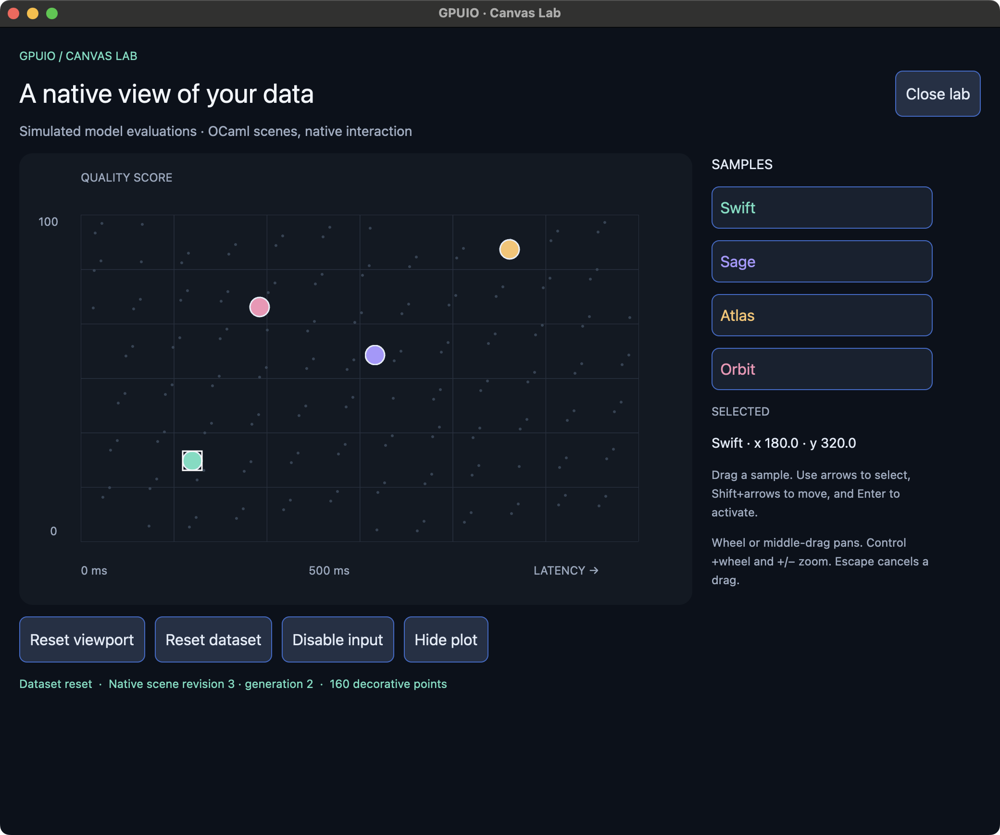

# Canvas Lab

Read the [implementation walkthrough](main.md) for actual model/functions,
Bonsai syntax, native ownership and diagnostic boundaries. Source: [main.ml](main.ml);
dependencies: [dune](dune).
The [typed plot walkthrough](plot.md) covers [plot.ml](plot.ml) and
[plot.mli](plot.mli).

A native, interactive plot built with public OCaml/Bonsai/Eio APIs. The evaluations
are deterministic simulated data. No application-specific Rust painting code,
network service or API key is involved.



From the repository root:

```sh
GPUIO_JOBS=2 ./scripts/gpuio exec dune build -j 2 examples/canvas/main.exe
_build/default/examples/canvas/main.exe
```

Select samples with a click or the sidebar. Drag a sample to move it; Escape
cancels the preview. Arrows/Home/End navigate samples, Shift+arrows move one logical
pixel, Alt+Shift+arrows move ten, and Enter/Space activate. Middle drag or wheel pans;
Control/platform-modified wheel zooms around the pointer and +/- zooms around the
canvas center. The reset, disable and hide controls exercise retained state and
lifecycle behavior. Accessible objects expose separate selection and activation
actions. A selected offscreen sample is revealed when pan/zoom is enabled.

`Plot` owns the typed scene: grid rectangles, text resources, decorative points and
four interactive ellipses. `main.ml` registers it with `Gpuio_eio.Canvas.create`
in the window scope and mounts `Gpuio_bonsai.View.canvas`. A native `Moved` event
updates the model with the resulting transform and calls `Canvas.set` once; drag
preview frames stay in Rust. Text resource contents/IDs remain stable across these
updates. Reset uses `Canvas.reset`, which starts a new scene generation. Closing
the window cancels its scope and releases its scene registration.

The default scene contains 184 items. `--large` uses 19,024 items, including 19,000
decorative points; both modes have four interactive samples. The inspector reports
world coordinates, not calibrated measurements. This is a canvas API example,
not a general charting library or a benchmark guarantee. The canvas has a fixed
700×470 logical-pixel viewport; the containing page scrolls when needed.

Validation:

```sh
_build/default/examples/canvas/main.exe --self-test
_build/default/examples/canvas/main.exe --self-test --large
python3 scripts/test_canvas.py
```

The self-test validates the public registration/view/event path, command replies,
same-generation updates, scene reset epochs, absence of idle OCaml view commits,
release and unmount. It opens an active window because an occluded macOS window
may defer rendering; a frame acknowledgement is not itself a GPU pixel assertion.
The separate macOS script uses the child application's actual accessibility tree
and targeted keyboard events to select, move and activate samples, hide/show,
reset and close. It requires macOS accessibility access, always reaps its child,
and can capture only the owned window with `--screenshot path.png`.

Exact platform coverage, measurements and remaining acceptance work are recorded
in [canvas evidence](../../docs/evidence/canvas-och24.md).
