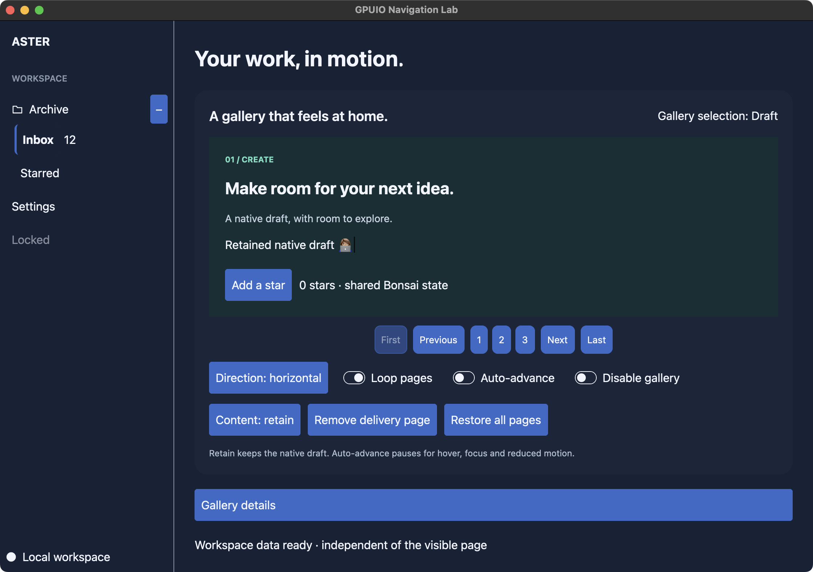

# Navigation Lab

Run `./scripts/gpuio exec dune exec examples/navigation/main.exe`.

The public Core/Bonsai/Eio example includes an accessible breadcrumb path,
bounded pagination over a billion-page archive, page-count shrink, a retained
collapsible editor and independently lazy Bonsai content. All data is local; no
network credentials or services are needed.

Page buttons send `Pagination.Request` values to a Bonsai state machine, which
reduces each against the latest model. The buttons do not own another selection.
Localized labels, ordinary native keyboard/AX actions and current-page descriptions
are supplied through `Navigation`. The two breadcrumb ancestors both return to the
archive's first page; the separate route card demonstrates native stack transitions.

The draft's Bonsai computation stays active when its native panel is hidden with
`Content_policy.Retain`. The separate lazy switch changes a Bonsai branch and its
lifecycle hooks. Neither cancels the archive data scope. Window closure cancels the
scope, including its long-lived subscription. Branch deactivation does not imply
Bonsai model eviction, and a native content policy does not cancel an Eio scope.

After building, `_build/default/examples/navigation/main.exe --self-test` opens
one local window, verifies queued page requests and shrink, edits/hides/restores a
Unicode draft, checks hidden focus denial, deactivates/reactivates lazy content,
completes data work while content is hidden, and verifies scoped shutdown. It
closes the window on completion or a reported failure. Native tests separately
cover actual Tab/Enter/AX activation and AppKit description readback.

This example covers implemented navigation/disclosure, carousel and modal overlay adapters. Broader acceptance remains part of OCH-37;
Linux GUI validation remains OCH-17.

The lab also includes the initial `Sidebar` composition: grouped nested links,
independent expansion, selected/disabled destinations, a scoped SVG icon, suffix,
header/footer, compact tooltips and command-based context menus. Its external
collapse button remains available in icon and offcanvas modes. Shift-F10 on a
focused destination opens its context menu. Mode changes preserve expansion and
do not reset the main draft. Allocated width animates natively with stable inner
layout and reduced-motion support. Retained offcanvas content slides out after it
becomes inert; Unmount removes children immediately. Run with `--right-sidebar` to place it on the other side.

On macOS, `python3 scripts/test_sidebar.py` exercises the owned application's AX
links/buttons and real context-menu keyboard path, checking current help,
disabled links, independent selection/expansion, icon/offcanvas geometry and
hidden AX content. `--images PATH` optionally captures the three visible states.
It closes/reaps its child on success or failure. This is separate from the public
self-test's reducer/lifecycle checks and from VoiceOver speech validation.

`python3 scripts/test_sidebar.py --motion` launches the lab's `--motion-test` mode
with two-second linear native transitions. It measures intermediate allocated width,
interrupts a collapse, verifies fixed inner width and offcanvas hiding/opening, and
settles a long transition through the application reduced-motion policy. The longer
duration and policy control are test-only; normal usage follows system preference.

Add `--right` to either sidebar test to exercise right-side placement. Motion
checks with `--images PATH` capture an intermediate offcanvas frame: the content
still paints while its AX subtree is already absent. `Style.Inert true` supplies
that distinction; retained buffers survive, focus/pointer/IME input does not.
## Mounted navigation pages

The **Native route transitions** card uses `Gpuio_bonsai.View.navigation_stack`
with an application-owned `Navigation_stack` model and explicit `Retain` policy.
Open the preview, replace its route, and go back to the draft. The draft's native
editor survives while hidden; Rust owns page motion and focus. Replacement removes
the old native page immediately. The existing lazy-computation and Eio data-scope
examples remain independent of route visibility.

`--self-test` additionally checks forward/replacement/back, preserved editor
snapshots and rejection of focus commands to the inactive route. Native tests
separately exercise GPU exit pixels, actual keyboard/AX behavior, disabled focus
fallback, Unmount and disposal. This example is an implementation lab, not complete
OCH-37 acceptance or the final chat showcase.

## Drawers and confirmations

The four drawer buttons open `Gpuio_bonsai.View.sheet` at each window edge. Native
layout clamps the configured extent and keeps focus inside until the app accepts
closure. Escape/backdrop requests close this example's drawer. The **Close with
confirmation** button opens a nested `View.alert_dialog`; **Keep open** is the
first eligible control and receives focus. Clicking its backdrop does nothing.
Escape or **Keep open** returns to the drawer; **Close details** removes both.

The self-test drives this flow through the public Bonsai reducer and verifies
that background editor focus is blocked and its draft survives. Actual native
keyboard/pointer, placement, resize, AX and dismissal routing are checked separately
by `native_controls`. These surfaces unmount on close; their application state and
Eio tasks are not implicitly cancelled by native visibility.

## Contributor hover card

Hover over or focus **Contributor preview** to open a nonmodal preview. Tab enters
its native note editor and can leave normally. The preview remains open while
focus or pointer is inside it; Escape closes after the editor's own IME handling.
The **Close preview** action closes through the Bonsai model. Its draft is retained
while hidden, and focus returns to the trigger when focused content closes.

The example uses Controlled ownership: native open/close requests feed the Bonsai
state machine. `Hover_card.Open_state.Managed` is also available for native-only
transient visibility. The public self-test checks closed focus rejection,
open focus eligibility and retained text. `native_hover_card` independently tests
real input, native delays, accessibility roles and timer disposal.

## Project carousel

Run `_build/default/examples/navigation/main.exe --carousel` for a focused gallery,
or use the gallery inside the full Navigation Lab. Draft, Review and Deliver have
independent page styling, a native draft editor, a shared Bonsai star counter, and
standard first/previous/numbered/next/last controls. Drag an open area or use the
carousel surface's axis arrows/Home/End. Child editors keep their own keys and
pointer gestures. Wheel navigation respects the selected axis.

Direction, looping, disabled state and optional four-second auto-advance are
interactive. Auto-advance pauses for hover, contained focus, dragging, hidden or
inactive windows and reduced motion; it does not queue ticks while paused. Remove
the selected delivery page to see selection clamp by the application model, then
restore the collection without replacing the mounted model's revision lineage.

**Content: retain** preserves the draft's native buffer and lease. Switching to
**Content: unmount**, leaving Draft, and returning creates a fresh native editor
with its initial text. This is an explicit demonstration of native resource
lifetime: the shared Bonsai stars and the workspace's Eio data scope keep living.
An application that needs drafts to survive native unmount should store those
values under its own data owner. Native visibility is not a persistence policy.

The typed state/actions and page descriptions live in `carousel_lab.ml` with an
explicit interface in `carousel_lab.mli`. Native requests go through the public
Eio event dispatcher and the ordinary Bonsai reducer; Rust never calls the page
builder synchronously. `--self-test` verifies retained snapshots, old-lease
rejection after unmount, initial-text remount, queued intents, axis/loop/shrink,
disabled requests and independent Bonsai/data lifetimes.

On macOS, `python3 scripts/test_carousel.py` additionally runs real AX/keyboard
interaction against its owned public app. It checks native carousel requests
through FFI/Eio/Bonsai, current-item help, child editor key precedence, modal
isolation, both axes, looping, disabled controls, explicit unmount and a native
auto-advance proposal. The harness forces full motion for its automation check;
normal application usage follows the system. Add `--images PATH` to capture settled
page screenshots. It closes and reaps the child on success or failure.

These checks complement the native GPU/pointer suites; broader OCH-37 family
acceptance and consolidated hosted gates remain tracked in Linear.
